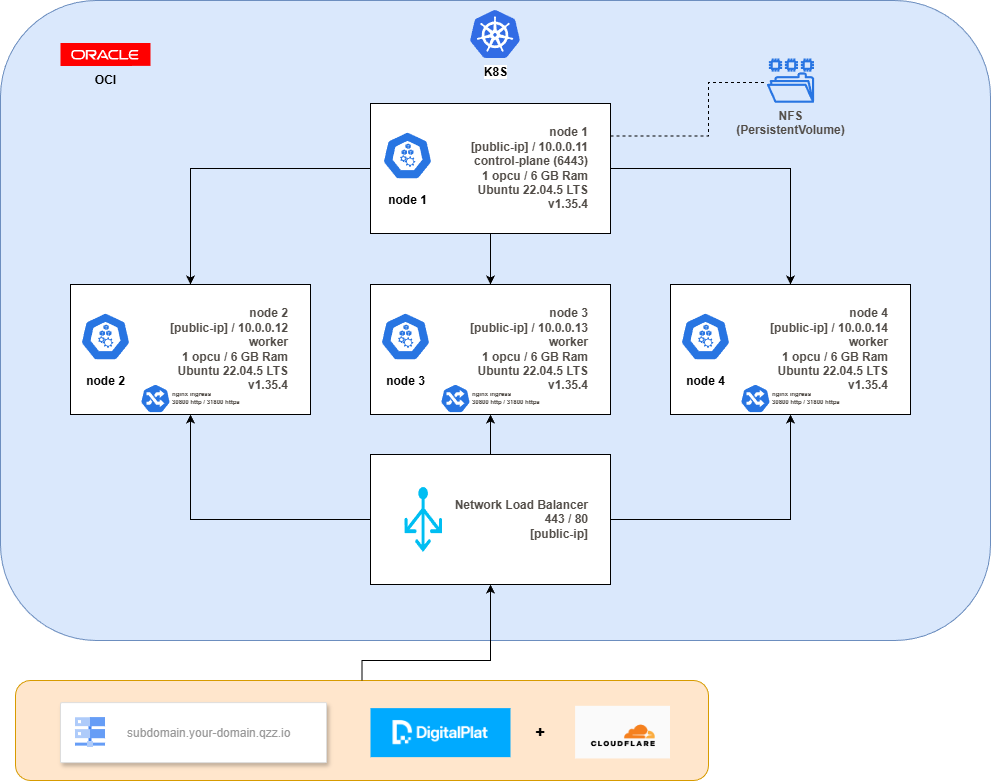

# Ampernetacle Plus

Ampernetacle Plus is a Terraform configuration for deploying a practical
multi-node Kubernetes cluster on [Oracle Cloud Infrastructure][oci]. It
creates OCI virtual machines, uses [kubeadm] to bootstrap the control plane,
joins the remaining machines as worker nodes, and installs useful cluster
add-ons for learning and experimentation.

It is a fork of the [Original Ampertacle Repository][original-ampertable],
with additional infrastructure helpers and Kubernetes add-ons for a more
complete test environment.

By default, it deploys a 4-node ARM cluster using Ubuntu 22.04 and
`VM.Standard.A1.Flex` instances. Each node has 1 OCPU and 6 GB of RAM,
which keeps the default setup aligned with Oracle's [free tier][freetier].

**It is not meant to run production workloads,**
but it's great if you want to learn Kubernetes with a "real" cluster
(i.e. a cluster with multiple nodes) without breaking the bank, *and*
if you want to develop or test applications on ARM.

## 🚀 Getting started

### Prerequisites

1. Create an Oracle Cloud Infrastructure account using [this link][createaccount].
2. Install [Terraform][terraform-install].
3. Install the [OCI CLI][oci-cli-install].
4. Install `kubectl` using the [Kubernetes installation guide][kubernetes-install].
   It is not required to create the cluster, but it is required to use it after provisioning.
5. Install SSH/SCP tools, or [OpenSSH][openssh-install], so Terraform can retrieve the generated `kubeconfig`.
6. Configure [OCI credentials][oci-credentials-config].
7. In OCI, create a bucket (Object Storage) to be used as backend storage for the Terraform scripts.
8. Download this project, enter its folder, and make sure `backend.hcl` contains
   your OCI Object Storage backend settings (created by previous step). You can use `backend.hcl.template` as
   a starting point.
9. Before running any apply script, create `terraform.tfvars` from the template and
   set `email_cert_issuer` to an email address you control. This value is required
   by cert-manager when registering the Let's Encrypt issuer.

If you authenticate with a session token, run `oci session authenticate`, choose
the correct region, and enter `DEFAULT` when the OCI CLI asks for the profile
name. The helper scripts also run this authentication flow before applying each
stack.


### Create the cluster

Linux/macOS:

```bash
chmod +x apply.sh fetch-kubeconfig.sh
./apply.sh
```

Tip: Apply permissions to all sh files...

```bash
find . -name "*.sh" -type f -exec chmod +x {} \;
./apply.sh
```

Windows PowerShell:

```powershell
.\Apply.ps1
```

The root apply script runs the core Terraform stack first and then executes the
`/nlb` stack automatically. This creates the OCI network, virtual machines,
Kubernetes cluster, generated `kubeconfig`, ingress-nginx, cert-manager,
metrics-server, NFS dynamic storage, and the OCI Network Load Balancer for
HTTP/HTTPS traffic. You do not need to run `/nlb` as a separate post-install
step unless you are working on that stack directly. For details, see the
[`/nlb` README](nlb/README.md).

### Optional application stacks

After the root apply script finishes, apply optional application stacks in this
order:

1. [PostgreSQL](postgresql/README.md)

2. [n8n database initializer](postgresql/n8n_db/README.md)

3. [n8n](n8n/README.md)

That's it!

At the end of the root apply flow, a `kubeconfig` file is generated
in this directory. To use your new cluster, you can do:

Linux
```bash
export KUBECONFIG=./kubeconfig
kubectl get nodes
```

Windows
```powershell
$env:KUBECONFIG=".\kubeconfig"
kubectl get nodes
```

The command above should show you 4 nodes, named `node1` to `node4`.

You can also log into the VMs. At the end of the Terraform output
you should see a command that you can use to SSH into the first VM
(just copy-paste the command).

## 🏗️ Architecture



## 🪟 Windows

It works with Windows 10+ and PowerShell 7.

It may be necessary to change the execution policy to run local scripts.

[PowerShell ExecutionPolicy][powerShell-executionpolicy]

## ⚙️ Customization

Check `variables.tf` to see tweakable parameters. You can change the number
of nodes, the size of the nodes, or switch to Intel/AMD instances if you'd
like. Keep in mind that if you switch to Intel/AMD instances, you won't get
advantage of the free tier.

## 🛑 Stopping the cluster

Use the matching destroy script for your platform:

Linux/macOS:

```bash
chmod +x destroy.sh
./destroy.sh
```

Windows PowerShell:

```powershell
.\Destroy.ps1
```

The root destroy script destroys `/nlb` first, then destroys the root cluster
stack. If you installed the optional application stacks, destroy them first in
reverse order:

1. n8n:

   ```bash
   ./n8n/destroy-n8n.sh
   ```

   ```powershell
   .\n8n\DestroyN8n.ps1
   ```

2. n8n database initializer:

   ```bash
   ./postgresql/n8n_db/destroy-n8n-db.sh
   ```

   ```powershell
   .\postgresql\n8n_db\DestroyN8nDb.ps1
   ```

3. PostgreSQL:

   ```bash
   ./postgresql/destroy-postgresql.sh
   ```

   ```powershell
   .\postgresql\DestroyPostgresql.ps1
   ```

## ✅ Cluster best practices

1. Define resources (requests and limits) for all containers ([Manage Resources Container - Official Documentation][manage-resources-containers])
2. Define liveness probe for all containers ([Liveness and Readiness Probes - Official Documentation][liveness-readiness-startup-probes])
3. Define readiness probes for all containers ([Liveness and Readiness Probes - Official Documentation][liveness-readiness-startup-probes])

### Resources, liveness, and readiness probe reference

- Resources
   - `requests`: Necessary resources to start/ready
      - `requests.cpu`: In millicpu. Example "2m".
      - `requests.memory`: Memory Unit. Example "5Mi".
   - `limits`: Limit to restart
      - `limits.cpu`: In millicpu. Example "2m".
      - `limits.memory`: Memory Unit. Example "5Mi".

- Liveness
   - `failureThreshold`: After a probe fails failureThreshold times in a row, Kubernetes considers that the overall check
   has failed: the container is not ready/healthy/live. Defaults to 3.
   - `initialDelaySeconds`: Number of seconds after the container has started before startup, liveness or readiness probes are initiated.
   - `periodSeconds`: How often (in seconds) to perform the probe. Default to 10 seconds. The minimum value is 1.
   - `successThreshold`:  Minimum consecutive successes for the probe to be considered successful after having failed. Defaults to 1.
   Must be 1 for liveness and startup Probes. Minimum value is 1.
   - `timeoutSeconds`:  Number of seconds after which the probe times out. Defaults to 1 second. Minimum value is 1.


## 🔧 Implementation details

This Terraform configuration:

- generates an OpenSSH keypair and a kubeadm token
- deploys 4 VMs using Ubuntu 22.04
- uses cloud-init to install and configure everything
- installs Docker and Kubernetes packages
- runs `kubeadm init` on the first VM
- runs `kubeadm join` on the other VMs
- installs the Weave CNI plugin
- installs ingress-nginx, cert-manager, metrics-server, and an NFS provisioner
- transfers the `kubeconfig` file generated by `kubeadm`
- patches that file to use the public IP address of the machine

## ⚠️ Caveats

This doesn't install the [OCI cloud controller manager][ccm],
which means that you cannot
create services with `type: LoadBalancer`; or rather, if you create
such services, their `EXTERNAL-IP` will remain `<pending>`.

Ingress traffic is handled by ingress-nginx using NodePorts, with the optional
OCI Network Load Balancer forwarding public HTTP and HTTPS traffic to those
ports. Dynamic storage is provided by an NFS provisioner running on the
control-plane node, which is useful for experiments but not highly available.

Security rules are intentionally permissive for learning and testing. This is
not a production-hardened Kubernetes platform.

## 💬 Remarks

Oracle Cloud also has a managed Kubernetes service called
[Container Engine for Kubernetes (or OKE)][oke]. That service
doesn't have the caveats mentioned above; however, it's not part
of the free tier.

## 🧩 What does "Ampernetacle" mean?

It's a *porte-manteau* between Ampere, Kubernetes, and Oracle.
It's probably not the best name in the world but it's the one
we have! If you have an idea for a better name let us know. 😊

## 🧯 Possible errors and how to address them

### Authentication problem

If you configured OCI authentication using a session token
(with `oci session authenticate`), please note that this token
is valid 1 hour by default. If you authenticate, then wait more
than 1 hour, then try to `terraform apply`, you will get
authentication errors.

#### Symptom

The following message:

```
 Error: 401-NotAuthenticated
│ Service: Identity Compartment
│ Error Message: The required information to complete authentication was not provided or was incorrect.
│ OPC request ID: [...]
│ Suggestion: Please retry or contact support for help with service: Identity Compartment
```

#### Solution

Authenticate or re-authenticate, for instance with
`oci session authenticate`.

If prompted for the profile name, make sure to enter `DEFAULT`
so that Terraform automatically uses the session token.

If you previously used `oci session authenticate`, you
should be able to refresh the session with
`oci session refresh --profile DEFAULT`.

### Capacity issue

#### Symptom

If you get a message like the following one:
```
Error: 500-InternalError
│ ...
│ Service: Core Instance
│ Error Message: Out of host capacity.
```

It means that there isn't enough servers available at the moment
on OCI to create the cluster.

#### Solution

One solution is to switch to a different *availability domain*.
This can be done by changing the `availability_domain` input variable. (Thanks @uknbr for the contribution!)

Note 1: some regions have only one availability domain. In that
case you cannot change the availability domain.

Note 2: OCI accounts (especially free accounts) are tied to a
single region, so if you get that problem and cannot change the
availability domain, you can [create another account][createaccount].

### Using the wrong region

#### Symptom

When doing `terraform apply`, you get this message:

```
oci_identity_compartment._: Creating...
╷
│ Error: 404-NotAuthorizedOrNotFound
│ Service: Identity Compartment
│ Error Message: Authorization failed or requested resource not found
│ OPC request ID: [...]
│ Suggestion: Either the resource has been deleted or service Identity Compartment need policy to access this resource. Policy reference: https://docs.oracle.com/en-us/iaas/Content/Identity/Reference/policyreference.htm
│
│
│   with oci_identity_compartment._,
│   on main.tf line 1, in resource "oci_identity_compartment" "_":
│    1: resource "oci_identity_compartment" "_" {
│
╵
```

#### Solution

Edit `~/.oci/config` and change the `region=` line to put the correct region.

To know what's the correct region, you can try to log in to
https://cloud.oracle.com/ with your account; after logging in,
you should be redirected to an URL that looks like
https://cloud.oracle.com/?region=us-ashburn-1 and in that
example the region is `us-ashburn-1`.

### Troubleshooting cluster creation

After the VMs are created, you can log into the VMs with the
`ubuntu` user and the SSH key contained in the `id_rsa` file
that was created by Terraform.

Then you can check the cloud init output file, e.g. like this:
```
tail -n 100 -f /var/log/cloud-init-output.log
```

### Troubleshooting SSH on PowerShell

```
# 1. Reset inheritance (remove all inherited permissions)
icacls "id_rsa" /inheritance:r

# 2. Grant explicit Read (R) access only to your current username
icacls "id_rsa" /grant:r "$($env:USERNAME):(R)"
```

### Troubleshooting NLB creation or destruction

Error: 409-Conflict, Invalid State Transition of NLB lifeCycle state from Updating to Updating
Try reduce parallelism or run terraform apply or destroy again
```
terraform apply -parallelism=1
terraform destroy -parallelism=1
```

### Troubleshooting Execution Shell scripts at Ubuntu (wsl2)

#### Symptom

```
Executing: terraform init -backend-config=./backend.hcl
Initializing the backend...
Initializing provider plugins...
- Finding oracle/oci versions matching "8.10.0"...
- Finding latest version of hashicorp/tls...
- Finding latest version of hashicorp/local...
- Finding latest version of hashicorp/null...
- Finding latest version of hashicorp/random...
- Finding latest version of hashicorp/cloudinit...
- Finding latest version of hashicorp/http...
- Installing hashicorp/random v3.8.1...
- Installed hashicorp/random v3.8.1 (signed by HashiCorp)
- Installing hashicorp/cloudinit v2.3.7...
- Installed hashicorp/cloudinit v2.3.7 (signed by HashiCorp)
- Installing hashicorp/http v3.5.0...
- Installed hashicorp/http v3.5.0 (signed by HashiCorp)
- Installing oracle/oci v8.10.0...
- Installing hashicorp/tls v4.2.1...
- Installed hashicorp/tls v4.2.1 (signed by HashiCorp)
- Installing hashicorp/local v2.8.0...
- Installed hashicorp/local v2.8.0 (signed by HashiCorp)
- Installing hashicorp/null v3.2.4...
- Installed hashicorp/null v3.2.4 (signed by HashiCorp)
╷
│ Error: Failed to install provider
│
│ Error while installing oracle/oci v8.10.0: github.com: Get "https://github.com/oracle/terraform-provider-oci/releases/download/v8.10.0/terraform-provider-oci_8.10.0_linux_amd64.zip": dial tcp: lookup
│ github.com on 10.255.255.254:53: no such host
╵
Command failed with exit code 1: terraform init -backend-config=./backend.hcl
```

Terraform is using the WSL DNS server 10.255.255.254 (in this example), and this DNS server is failing specifically during the Oracle provider download.

#### Solution

Edit `/etc/resolv.conf`:

```
sudo cp /etc/resolv.conf /etc/resolv.conf.bak
sudo rm -f /etc/resolv.conf
printf "nameserver 1.1.1.1\nnameserver 8.8.8.8\noptions timeout:2 attempts:3\n" | sudo tee /etc/resolv.conf
```

### Useful
```
Add-WindowsCapability -Online -Name OpenSSH.Client~~~~0.0.1.0
```

```
terraform apply *>&1 | Tee-Object -FilePath ("apply-{0}.log" -f (Get-Date -Format "yyyyMMdd-HHmmss"))
terraform destroy *>&1 | Tee-Object -FilePath ("apply-{0}.log" -f (Get-Date -Format "yyyyMMdd-HHmmss"))
```

### Force Unlock

```
terraform force-unlock d574b9c2-35b3-203c-5592-8e26bdb24846
```

## 🌐 Digital Plat

To register a free domain, useful for tests and POCs.

   - https://domain.digitalplat.org/
   - https://github.com/DigitalPlatDev/FreeDomain/blob/main/documents/tutorial/getting-started/1.1-register-account.md
   - https://github.com/DigitalPlatDev/FreeDomain/blob/main/documents/tutorial/getting-started/1.2-dns-hosting.md


[ccm]: https://github.com/oracle/oci-cloud-controller-manager
[createaccount]: https://bit.ly/free-oci-dat-k8s-on-arm
[freetier]: https://www.oracle.com/cloud/free/
[kubeadm]: https://kubernetes.io/docs/reference/setup-tools/kubeadm/
[oci]: https://www.oracle.com/cloud/compute/
[oke]: https://www.oracle.com/cloud-native/container-engine-kubernetes/
[manage-resources-containers]: https://kubernetes.io/docs/concepts/configuration/manage-resources-containers/
[liveness-readiness-startup-probes]: https://kubernetes.io/docs/tasks/configure-pod-container/configure-liveness-readiness-startup-probes/
[original-ampertable]: https://github.com/jpetazzo/ampernetacle
[kubernetes-install]: https://kubernetes.io/docs/setup/production-environment/tools/kubeadm/install-kubeadm/#installing-kubeadm-kubelet-and-kubectl
[terraform-install]: https://learn.hashicorp.com/tutorials/terraform/install-cli?in=terraform/oci-get-started
[oci-cli-install]: https://docs.oracle.com/en-us/iaas/Content/API/SDKDocs/cliinstall.htm
[openssh-install]: https://www.openssh.org/
[oci-credentials-config]: https://learn.hashicorp.com/tutorials/terraform/oci-build?in=terraform/oci-get-started
[powerShell-executionpolicy]: https://learn.microsoft.com/en-us/powershell/module/microsoft.powershell.security/set-executionpolicy?view=powershell-7.6
